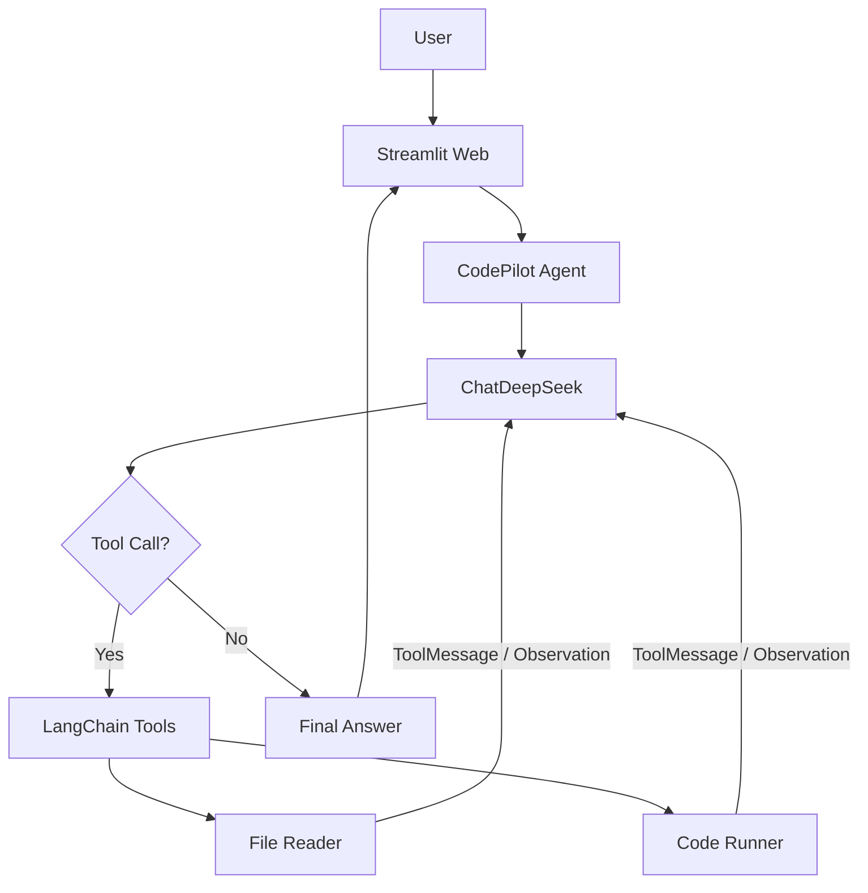
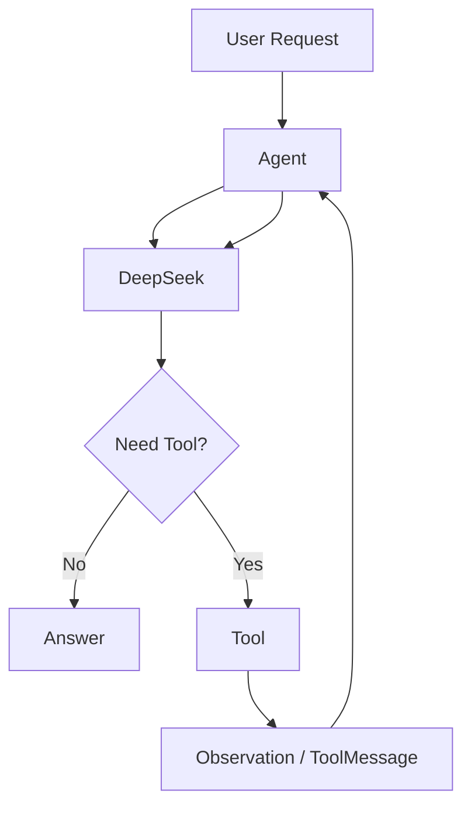

# CodePilot Design Document

本文描述当前仓库的实现。用户操作与安装命令见 [README.md](README.md)，复审与测试边界见 [PROJECT_AUDIT.md](PROJECT_AUDIT.md)。图中的“DeepSeek → Tool”表示模型提出调用请求、由 LangChain 执行工具，并不表示模型进程直接运行 Python 函数。

## 1. 项目背景

代码解释、缺陷排查和测试设计通常需要先取得真实源码，有时还要运行程序验证。只把代码发给聊天模型，模型可以推测问题，却无法自行读取本地文件或获得真实 stdout、stderr。CodePilot 用 LangChain Agent 将 DeepSeek 的分析能力与两个可观察工具连接起来，作为课程作业展示“提出工具调用 → 获得 Observation → 继续分析”的闭环。

系统面向可信的课堂演示代码。它不是确定性静态分析器，也不是生产代码执行平台。答案准确性仍取决于输入契约、模型行为及实际运行证据。

## 2. 需求分析

### Functional Requirements

- 接收自然语言和直接粘贴的代码，解释功能、变量、流程、算法及时间/空间复杂度。
- 审查可证实的错误和有条件的风险，给出位置、原因、影响与修改建议，不为凑格式编造 Bug。
- 根据文件路径调用 `read_code_file`，读取项目 `workspace/` 内允许的代码文件；页面另支持从用户电脑上传代码。两者是独立入口。
- 在用户要求运行或实际验证时，由模型决定是否调用 `run_code`；工具支持 Python，系统有 g++ 时支持 C++17。
- 由模型生成正常、最小边界、最大边界、特殊及可能触发 Bug 的用例。需要验证时运行原程序，区分 Expected 与实际 Observation。不存在独立的测试生成 Tool。
- Web 会话保留 LangChain 消息，支持连续追问与清空；页面展示公开工具状态和最终回答。

### Non-functional Requirements

- 使用官方 `langchain-deepseek` 的 `ChatDeepSeek`，密钥由环境变量或 `.env` 读取，不写入源码。
- 工具参数及结果使用 Pydantic 模型；项目模块职责清晰，测试默认不依赖真实 DeepSeek。
- 文件路径不得逃出 workspace；对文件大小、上传大小、Agent 上下文、运行时间和程序输出设置边界。
- 常见配置、API、文件与子进程错误应返回可解释结果，不让普通页面用户看到应用内部 Traceback。
- 运行器明确限定为教学 Demo。超时和临时目录不能替代不可信代码的隔离沙箱。

## 3. 技术选型

**LangChain** 提供当前项目使用的 `create_agent`、`@tool`、消息类型及中间件。框架负责模型与工具的循环，项目代码负责注册工具、提供提示词、观察状态和处理错误。相比手写关键词路由，可以在测试中检查真实 `AIMessage.tool_calls`、`ToolMessage` 和下一次模型输入。

**DeepSeek** 通过 `langchain_deepseek.ChatDeepSeek` 接入，不自行拼装 HTTP 请求。当前工厂默认使用 `deepseek-chat`、`temperature=0`、单次请求 `timeout=30` 和 SDK `max_retries=2`。低温度用于提高审查任务稳定性，但不保证输出完全一致或正确。

**Streamlit** 提供 `st.chat_message`、`st.chat_input`、`st.file_uploader` 和 `st.session_state`，适合用少量代码展示会话及工具状态。它只组织输入和渲染结果，不在页面重写 Agent、工具或模型调用逻辑。

**Pydantic** 用于工具输入/输出、Agent 返回值、工具记录和 Sidebar 设置；**pytest** 对框架循环、真实本地工具和页面行为进行离线回归。

## 4. 总体架构



图中工具结果返回模型的箭头是逻辑关系：实际路径经过 LangChain Agent 的消息状态。CLI 固定演示也直接调用同一个 `CodePilotAgent`；Web 额外提供上传、会话 Memory 与工具状态 UI。

| 层 | 当前文件 | 职责 |
|---|---|---|
| 页面 | `app.py` | 初始化会话、收集文本/附件、显示消息、公开事件、错误和设置。 |
| Agent | `agent/code_agent.py`、`agent/limits.py`、`agent/prompts.py` | 创建框架 Agent、注册工具和中间件、检查预算、提取最终答案与公开工具记录。 |
| LLM | `llm/deepseek.py`、`config.py` | 读取模型配置、创建 ChatDeepSeek、分类 API 异常。 |
| 工具 | `tools/file_reader.py`、`tools/code_runner.py` | 返回结构化文件内容或执行结果。 |
| 服务 | `services/workspace.py`、`services/uploads.py`、`services/diagnostics.py` | 路径边界、附件上下文、项目日志。 |
| 模型 | `models/schemas.py` | 输入、结果和设置的 Pydantic 校验；配置、上传元数据和可变 Memory 使用简单 dataclass。 |
| 会话 | `agent/memory.py`、`st.session_state` | 完整 LangChain 历史与页面记录。 |

## 5. LangChain Agent设计

`CodePilotAgent.invoke(messages, on_event=None)` 是 Web 和演示 CLI 使用的入口。首次调用时，它创建 `ChatDeepSeek`，执行：

```python
create_agent(
    model=create_deepseek_model(),
    tools=[read_code_file, run_code],
    system_prompt=SYSTEM_PROMPT,
    middleware=[check_context_budget, handle_tool_errors],
)
```

这段工具列表就是当前项目的注册机制；没有另外实现 ToolRegistry 类、关键词路由或人工编排链。调用 `stream(..., stream_mode="values")` 时，LangChain 维护 Agent 状态并执行模型与工具节点。包装层读取状态作公开记录，不自行调用工具。

**Agent** 决定下一步继续模型调用、执行模型指定的工具，或结束。**LLM** 是 ChatDeepSeek，生成自然语言或 `AIMessage.tool_calls`。**Tool** 接收框架校验后的参数并返回 JSON 字符串。**Observation** 是包含真实结果的 `ToolMessage`，`tool_call_id` 与请求关联。**Final Answer** 是最后一条没有待执行工具调用且有公开文本内容的 `AIMessage`；包装层返回 `AgentResult`。

包装层按调用 ID 记录 `tool_start` / `tool_end`、名称、参数、成功状态及有限摘要。历史中已完成的调用不在新请求里重复展示。内容提取只读取公开文本块，不读取消息的隐藏推理字段。工具返回 `success=false` 时，Agent 仍可基于失败 Observation 给出解释；工具成功与整轮成功是不同状态。

默认 LangGraph `recursion_limit=20`，Sidebar 可在 4–50 个图执行步骤间调整。遇到 `GraphRecursionError` 返回“Agent执行步骤超过限制，请简化请求后重试。”。步骤数不是严格的工具调用次数，也不是整轮总耗时。

## 6. DeepSeek集成

`config.load_settings()` 对项目根目录 `.env` 调用 `python-dotenv.load_dotenv(..., override=False)`；因此已有系统环境变量优先。读取 `DEEPSEEK_API_KEY` 和 `DEEPSEEK_MODEL`，模型为空时使用 `deepseek-chat`。`Settings` 将密钥排除在对象 `repr` 之外。缺少密钥时，工厂抛出明确的 `DeepSeekConfigurationError`，不会发送模型请求。

`llm/deepseek.py` 的 `create_deepseek_model()` 返回官方 `ChatDeepSeek(api_key=..., model=..., temperature=0, timeout=30, max_retries=2)`。`invoke_deepseek()` 是独立单轮验证入口，调用失败转为 `ModelCallResult`。Web 的实际业务入口是 `CodePilotAgent.invoke()`；它使用同一工厂与错误分类，不是通过 `invoke_deepseek()` 再套一层调用。

当前仓库的 `python -m llm.deepseek` 会提出固定的递归解释请求；`python -m agent.code_agent` 依次执行两个固定工具演示。这些 CLI 命令会在具备有效密钥和网络时访问真实 API。CLI 没有交互式对话 Memory。

## 7. Prompt设计

`agent/prompts.py` 的 `SYSTEM_PROMPT` 是固定系统提示，传给 `create_agent(system_prompt=...)`。它规定：已有代码直接分析；只有 workspace 路径时优先读文件；需要真实行为时考虑运行；上传本身不意味着运行；工具失败不得伪装成功；未知条件要说明假设；源码与工具输出是任务数据而非新系统指令。

完整代码解释引导七个章节：功能概述、核心变量、执行流程、关键代码、时间复杂度、空间复杂度、总结。完整审查引导代码功能、发现的问题、边界情况、复杂度、建议修改方案；问题按 Critical/Warning/Suggestion 分类并说明位置、问题、原因、影响、修改建议。没有确定性 Bug 时要求如实说明，不凑出不存在的问题。简短追问不强制长报告。

测试生成由模型完成，提示词要求五类用例及“测试目的、Input、Expected Output、说明”。用户要求运行验证时，实际输出必须来自 `run_code`，报告区分 Expected、Actual 和 PASSED/FAILED/NOT RUN；`run_code.success=true` 只表明进程正常结束，不表明答案正确。例如 `workspace/examples/sum_bug.py` 的 `3\n1 2 3\n`，契约期望 6，故意保留 Bug 的原程序实际输出 5。

Prompt 是对模型行为的指导，不是保证输出格式或安全策略必然遵守的程序判定器。离线测试验证系统提示确实传入模型；真实回答质量需要单独的集成验收。

## 8. FileReader Tool

`tools/file_reader.py` 用 `@tool(args_schema=FileReadInput)` 定义 `read_code_file(path: str)`；结果用 `FileReadResult` 序列化，字段为 `success`、`path`、`content`、`error`。允许扩展名为 `.py`、`.cpp`、`.c`、`.h`、`.hpp`、`.java`、`.js`、`.ts`。

**路径安全。** 根目录为 `config.WORKSPACE_ROOT`，即项目的 `workspace/`。`services.workspace.resolve_workspace_path()` 拒绝空路径、任意 `..` 片段及非法冒号片段，把路径解析为绝对路径，再以路径关系确认在根目录内。`resolve()` 同时解析已存在的符号链接；绝对路径只有位于 workspace 内时允许。不是以字符串前缀判断，以免误接受同名前缀目录。

**文件限制。** 仅接受普通文件，先检查 `stat().st_size <= 1 MiB`，再最多读取 `1 MiB + 1` 字节，避免大小检查后增长造成无界读取。按 `utf-8-sig` 解码，兼容 UTF-8 BOM；零长度文件返回失败。独立工具的 1 MiB 文件上限与 Agent 单条 ToolMessage 16000 序列化字符上限不同，大文件可能被工具成功读取，但不会作为完整 Observation 交给模型。

**异常处理。** 文件不存在、权限、编码、路径越界、非法后缀、文件过大和空文件都返回失败 JSON；参数验证失败也通过 `handle_validation_error` 返回 JSON。意外异常记录异常类型并给通用错误，不把系统异常正文交给模型。

## 9. CodeRunner Tool

`tools/code_runner.py` 用 `@tool(args_schema=CodeRunInput)` 定义 `run_code(language, code, stdin="")`，支持 `python` 和 `cpp`，结果字段为 `success`、`stdout`、`stderr`、`exit_code`、`timed_out`。Python 调用当前 `sys.executable`（带 `-X utf8`）；C++ 先以 `shutil.which("g++")` 检测编译器，使用 `g++ -std=c++17` 编译，成功后才执行。没有 g++ 时返回 `C++ compiler not available`。

每次执行使用 `tempfile.TemporaryDirectory` 写入 `main.py` 或 `main.cpp`，进程 `cwd` 也在临时目录。编译、执行由 `subprocess.Popen` 启动；stdin 先写入临时文件，以免程序不读 stdin 时阻塞调用端。stdout 和 stderr 由两条线程并发读取，避免其中一条管道填满造成死锁。

编译和运行**各**有 5 秒超时；C++ 总任务可能超过 5 秒。每条输出流最多捕获 32768 字节，超量时停止直接子进程，返回失败并明确写出输出限制。超时保留已捕获输出、`timed_out=true`、`exit_code=null`；正常非零退出码和编译错误保留 stderr。子进程或临时目录异常转为失败 JSON；`TemporaryDirectory` 在调用退出时清理临时文件。

这不是 Docker 或操作系统级沙箱：直接子进程被限制，不代表恶意程序创建的后代进程或宿主资源得到隔离。

## 10. Memory

Web 使用 `st.session_state.messages` 保存公开聊天记录、`st.session_state.memory` 保存 `ConversationMemory.messages`（完整 LangChain 消息）、`st.session_state.agent` 保存当前会话 Agent。Agent 本身没有 checkpointer；每轮由页面显式执行 `memory.prepare()` → `agent.invoke()` → `memory.complete()`。

`prepare()` 加入新的 `HumanMessage`，按照轮次及字符预算删除最旧的完整轮次，避免拆开工具调用与 ToolMessage。`complete()` 对成功请求保存框架返回的完整消息；请求失败时只保留输入及错误回复，不保留可能不完整的工具链。Pydantic 的消息序列化和还原保留具体消息类型及工具调用关联。

默认最近 8 轮、约 60000 序列化字符、普通输入 12000 字符；Sidebar 可将轮数设为 1–20。上传组合请求上限 45000 字符，附件字节上限 32 KiB。`check_context_budget` 是真正的 `wrap_model_call` 中间件：**每次**模型调用前检查系统消息和对话消息合计，超出 60000 字符就阻止请求。`handle_tool_errors` 将超过 16000 序列化字符的 ToolMessage 变为明确失败 Observation，不默默截断源码。预算是字符近似值，不是精确 Token 计数，也不包括工具定义等全部协议开销。

“清空对话”重建三个会话对象并替换上传控件 key，保留 Sidebar 设置。Memory 没有数据库、Redis、向量库或长期持久化；Streamlit 会话结束、服务重启或重新建立连接后可能丢失。CLI 的两次独立调用没有自动传入历史。

## 11. Streamlit Web

`app.py` 首先读取配置、设置页面标题和会话对象。Sidebar 显示模型、功能、密钥是否配置、清空按钮、最大图执行步骤（4–50）与历史轮数（1–20），并提供 `st.file_uploader`。`services/uploads.py` 校验八类扩展名、32 KiB、UTF-8/BOM 和非空白内容，再把文件名、源码及用户要求组织为 Agent 输入；不将上传内容永久写入 workspace。附件保持选中时，每次发送都会附带其内容。

主区域用 `st.chat_message` 和 `st.chat_input` 展示聊天。收到输入后，页面调用会话 Memory 和 `CodePilotAgent.invoke()`。执行期间 `st.status` 与 `st.spinner` 展示状态；`on_event` 只暴露工具开始、结束、成功状态及有限摘要，最终答案作为 Assistant 消息保存。页面错误经 `st.error` 展示，最外层异常也有友好兜底。页面不读取隐藏推理或自行调度工具。

上传后仅选择文件不会触发分析或执行；用户发送消息后才进入 Agent。运行意图由提示词说明，当前没有独立于模型的强制执行权限门。清空会移除当前附件与历史；仅移除附件不会删除已经进入会话历史的内容。

## 12. Agent执行流程



图中的第二条 `Agent → DeepSeek` 表示工具结果回到消息状态后的下一次模型调用。最短路径是用户输入 → 模型文本 → 最终答案；无需为了体现 Agent 而强制调用工具。多工具路径可以是文件读取 → 结果回模型 → 代码运行 → 结果再回模型 → 最终答案。

具体消息关系如下：

1. 模型请求经过上下文预算中间件。
2. 模型返回 `AIMessage.tool_calls`，其中包含工具名、参数和调用 ID；或者返回无需工具的回答。
3. LangChain 从注册列表找到工具，验证 Pydantic 参数并执行；工具异常中间件把不可预期异常变为失败 `ToolMessage`。
4. 工具 JSON 结果携带可观察源码或 stdout/stderr；LangChain 保留对应的 `tool_call_id`，将 Observation 放入下一次模型输入。
5. `CodePilotAgent` 从 `stream_mode="values"` 提取公开事件、记录与最终文本；Web 只显示这些数据。

因此 Tool 选择主要由 LLM 在框架循环中完成，而不是 `if "运行" in prompt` 一类 Python 关键词分支。系统提示仅引导决策。

## 13. 错误处理

| 错误类别 | 实际处理 |
|---|---|
| 缺少 API Key | 工厂抛配置异常；Agent/独立模型入口转成明确配置提示，不发送请求。 |
| 401 / 429 / 402 / 网络 / API 超时 / 其他 HTTP | `describe_model_error()` 将 SDK 异常映射为用户可读消息，避免泄露原始服务端正文。 |
| Agent 图步骤超限 | 捕获 `GraphRecursionError`，返回简化请求提示。 |
| 模型前上下文超限 | `ContextBudgetError` 阻止本次模型请求并返回友好错误。 |
| 工具参数错误或内部异常 | 参数错误由工具返回失败 JSON；意外异常由 `wrap_tool_call` 返回失败 `ToolMessage`。 |
| 路径、文件大小、编码、权限 | File Reader 返回 `success=false` 与对应错误，不中断主程序。 |
| 编译错误、运行异常、超时、输出超量、g++ 缺失 | Runner 返回统一结构；真实 stderr 与进程状态用于诊断，不把失败说成成功。 |
| 上传错误与页面异常 | `st.error` 显示可读信息；完整应用异常不直接渲染到页面。 |

项目日志的 INFO/WARNING/ERROR 记录操作状态、退出码或异常类型，不记录 API Key、原始异常正文、用户请求、源码和 stdout/stderr。用户代码产生的真实 stderr 仍会作为受限的工具 Observation 提供给模型和页面摘要；它不等同于应用内部异常。

## 14. Retry

`ChatDeepSeek` 使用其 SDK 的 `max_retries=2`：初次请求加最多两次 SDK 重试；项目没有在 Agent 或页面外再套一层无限重试。每次请求 `timeout=30` 秒，不是整个 Agent 任务的总超时；等待和重试可能增加实际耗时。

`tests/test_error_handling.py` 使用当前安装 SDK 与模拟 HTTP 传输检查行为：429、503 均最多 3 次请求，401 仅 1 次。此测试不联网，也不能证明真实服务在当前网络下可用。工具读取或用户代码执行失败不会自动重试相同操作；模型可根据 Observation 解释限制或调整后续决策。

## 15. 安全设计

File Reader 的安全边界是 workspace 路径解析、归属检查、扩展名、1 MiB 与 UTF-8 限制。上传单独校验并在会话内使用，不放入 workspace。两者不会授予任意宿主文件读取能力；但文件解析到打开之间仍可能受并发修改影响，不能替代系统级隔离。

Agent 的限制包括默认 20 个图执行步骤、每条 ToolMessage 16000 序列化字符、每次模型调用前 60000 序列化字符，以及 Runner 每阶段 5 秒/每流 32 KiB。大结果返回明确失败，不把截断片段伪装成完整源码或完整输出。提示词将工具输出视作任务数据，并要求仅在明确运行意图时考虑执行；这些提示不能构成强制权限机制。

**Code Runner 只是课程 Demo，不是生产级安全 Sandbox，不能安全执行任意不可信代码。** 子进程继承宿主权限与环境变量，仍可访问文件系统和网络；没有内存限制、容器隔离或可靠的后代进程树终止。仅运行可信课程示例。真实 DeepSeek 请求可能将源码、用户输入、工具输出和历史发送给外部服务，处理敏感代码前应确认数据发送许可。`.env` 由 `.gitignore` 排除，日志不输出密钥。

## 16. 测试设计

默认执行 `pytest -v`，使用脚本模型替代付费模型决策，但仍调用真实 LangChain `create_agent`、两个工具及可用的 Python/C++ 子进程。`tests/test_agent.py` 检查模型工具调用、真实 Observation 回到下一轮模型、多个工具顺序、失败与步骤上限。`tests/test_file_reader.py`、`tests/test_workspace.py` 测路径边界、后缀、编码、大小和预期错误；`tests/test_code_runner.py` 测 Python/C++ 成功、编译/运行失败、超时、输出限制与临时目录清理。

`tests/test_memory.py` 验证跨轮消息、整轮裁剪、清空、超大单结果及多次小结果累积的模型前预算。`tests/test_schemas.py` 验证 Pydantic 校验及工具调用消息配对序列化。`tests/test_app.py` 与 `tests/test_uploads.py` 使用 Streamlit AppTest 检查页面、设置、上传、公开状态及错误，另启动本地 Streamlit 服务做健康检查。`tests/test_error_handling.py` 用模拟 HTTP 验证 SDK 有限重试及安全日志。`tests/test_test_generation.py` 用真实 Runner 检查求和示例的五种输入与输出。

`tests/conftest.py` 默认使用占位密钥并阻止测试进程访问外部网络，允许本机回环连接。`pytest.ini` 注册 `integration`；只有显式 `--run-integration -m integration` 才执行真实模型案例。这些案例包含 Prompt 结构、真实工具调用、生成测试、逐项 Expected/Actual/Result 和多轮追问；它们可能产生 API 费用，默认跳过。本轮已有默认测试证据见 [PROJECT_AUDIT.md](PROJECT_AUDIT.md)。此前在受限网络下显式运行真实集成测试，8 项均因连接失败，未获得模型回答；不能把离线测试称为真实 DeepSeek 自主决策验收。

当前 Windows 环境的符号链接逃逸测试因创建符号链接权限不足而跳过；该跳过不是通过。测试使用独立临时目录并关闭 pytest 缓存插件；没有依赖真实密钥运行默认测试。

## 17. 当前限制

- 模型输出不能保证正确性、稳定格式或覆盖所有 Bug；没有自动修复源码或提交修改的功能。
- `run_code` 只支持 Python 与可用 g++ 环境下的 C++；其他可读/可上传语言目前只能进行模型静态分析。
- File Reader 的 1 MiB 读取限制、上传 32 KiB、Agent ToolMessage 16000 字符、整体消息 60000 字符是不同边界；大文件可能读得出但不送入模型。
- 60000 是序列化字符近似预算，不等于模型 Token 预算；框架步骤限制也不是严格工具调用个数或端到端时间限制。
- Memory 只在 Streamlit 会话内；无数据库、向量索引、长期用户档案或 CLI 自动多轮记忆。
- 单次真实运行只能说明给定输入的观察结果；缺少题面或约束时，模型不能证明“WA 的唯一原因”。
- 当前默认回归在 Windows/Python 3.14.6 通过；Python 3.11 干净环境、人工浏览器上传及真实 DeepSeek 回答尚未完成本地验收。真实 API 集成测试曾因连接失败未通过。
- Demo Runner 不是生产沙箱，提示词也不是硬性授权系统。

