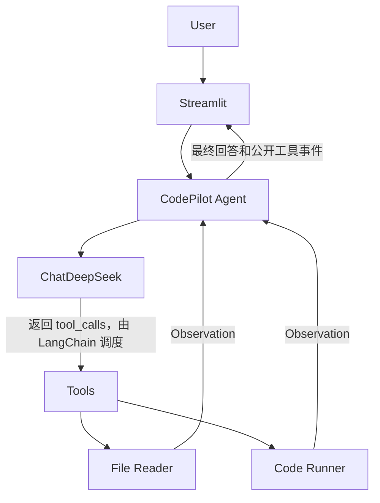

# CodePilot

基于 LangChain + DeepSeek 的智能代码审查 Agent。

## 快速开始

以下命令适用于 **Windows PowerShell**，在含 `app.py` 的项目根目录执行：

```powershell
python -m venv .venv
.\.venv\Scripts\python.exe -m pip install -r requirements.txt
if (-not (Test-Path .env)) { Copy-Item .env.example .env }
```

在本地 `.env` 中填写有效的 `DEEPSEEK_API_KEY`，然后启动页面：

```powershell
.\.venv\Scripts\python.exe -m streamlit run app.py
```

打开终端显示的 Local URL。无需激活虚拟环境，也无需修改 PowerShell 执行策略。macOS/Linux 与其他安装方式见[安装与运行](#安装与运行)。运行前请阅读[安全说明](#安全说明)：Code Runner  Demo，不是生产沙箱。

## 目录

- [项目概览](#项目概览)：简介、目标、功能与技术栈
- [架构与实现](#架构与实现)：Mermaid 架构图、Agent 流程与目录树
- [安装与运行](#安装与运行)：环境、密钥、Web 与 CLI
- [使用指南](#使用指南)：示例、两个工具与 Memory
- [验证与边界](#验证与边界)：测试、错误处理、安全、限制及后续工作

## 项目概览

### 项目简介

CodePilot 是一个基于 LangChain 和 DeepSeek 实现的智能代码审查 Agent，使用 Streamlit 提供聊天式 Web 界面。用户可以粘贴代码、上传代码文件，或指定项目 workspace 中的文件，请求解释、审查、运行和生成测试。

项目通过 LangChain `create_agent` 管理模型与工具的循环。DeepSeek 可以根据请求决定调用文件读取或代码运行工具，接收真实执行结果后继续分析。页面展示工具名称、输入摘要、成功或失败状态和结果摘要，不读取或展示模型隐藏推理。

设计说明见 [DESIGN.md](DESIGN.md)。

### 项目目标

- 展示自然语言请求、LLM 决策、Tool Calling、Observation 回传与最终回答的完整流程。
- 结合真实文件和程序输出分析问题，区分静态推断、预期输出和实际结果。
- 支持会话内连续追问，保持工具调用与结果的消息配对。
- 对配置、网络、文件、编译、运行及预算错误提供清晰反馈。
- 保持代码简单、模块化，便于课程演示和答辩。

### 核心功能

| 功能 | 当前实现 |
|---|---|
| 代码解释 | 通过提示词引导模型解释功能、变量、流程、关键算法和时间/空间复杂度。 |
| 代码审查 | 引导模型检查 Bug、边界、异常、复杂度、可读性及竞赛代码风险，按 Critical、Warning、Suggestion 分类。 |
| 文件读取 | Agent 可调用 `read_code_file` 读取 workspace 内的允许代码文件。 |
| 代码运行 | `run_code` 支持当前 Python 解释器；有 g++ 时支持 C++17，返回真实输出、错误、退出码和超时状态。 |
| 测试生成 | 模型生成五类测试；明确要求验证时使用运行工具，区分 Expected、Actual 和 Result。没有独立测试生成 Tool。 |
| 多轮对话 | Web 会话显式保留 LangChain 消息历史，支持追问及清空。 |

界面另提供代码上传、公开工具执行过程及 Agent 设置。仅选择上传文件不会调用 Agent 或执行代码。解释和审查的运行意图规则由提示词约束，工具选择仍由模型决定。

### 技术栈

| 技术 | 用途 |
|---|---|
| Python 3.11+ | 项目语言；当前验收环境为 Python 3.14.6。 |
| LangChain / langchain-core | 创建 Agent、消息类型和工具定义。 |
| DeepSeek / langchain-deepseek | 官方 `ChatDeepSeek` 集成；默认模型 `deepseek-chat`。 |
| Streamlit | 页面、聊天控件、上传和会话状态。 |
| Pydantic | 工具输入/输出、Agent 结果和设置模型。 |
| python-dotenv | 从项目根目录 `.env` 加载配置。 |
| pytest | 默认离线测试及单独启用的真实 API 集成测试。 |
| LangGraph / OpenAI SDK / httpx | Agent 图执行异常、模型 SDK 异常分类及模拟 HTTP 测试。 |

直接依赖版本固定在 `requirements.txt`。项目没有使用 CrewAI、AutoGen 或 Dify。

## 架构与实现

### 系统架构



`app.py` 负责输入和展示；`CodePilotAgent` 封装框架调用；模型由 `llm/deepseek.py` 工厂创建。工具通过 `create_agent(tools=[read_code_file, run_code])` 注册，没有独立 ToolRegistry 类。

### Agent 工作流程

1. Web 接收用户输入；有附件时加入文件名、源码和用户要求。
2. `ConversationMemory.prepare()` 加入当前用户消息，裁剪旧轮次。
3. `CodePilotAgent.invoke()` 将历史传入真实 LangChain Agent。首次调用才创建模型和 Agent。
4. 每次模型请求前，中间件检查系统提示与消息的上下文预算。
5. DeepSeek 返回最终文本，或返回包含工具名、参数和调用 ID 的 `tool_calls`。
6. LangChain 校验参数并执行对应工具，把结果作为关联的 `ToolMessage` 加入消息状态。
7. 模型接收 Observation，继续调用工具或生成最终回答。一次请求可以连续调用多个工具。
8. 包装层从消息状态提取公开工具事件和最终回答；Web 保存页面记录，Memory 保存完整结果。

没有通过用户关键词直接调用 Python 工具来冒充 Agent。工具失败可以成为模型继续回答的依据；工具失败不一定代表整轮 Agent 请求失败。图执行步骤、上下文及工具结果均有上限。

### 项目目录

```text
CodeAgent/
├── app.py                       # Streamlit 页面
├── config.py                    # 配置加载与 workspace 根目录
├── requirements.txt             # 固定直接依赖版本
├── pytest.ini                   # 测试配置与 integration 标记
├── .env.example                 # 空环境变量模板
├── .gitignore
├── README.md
├── DESIGN.md
├── PROJECT_AUDIT.md
├── agent/
│   ├── __init__.py
│   ├── code_agent.py            # create_agent 封装、结果与事件提取
│   ├── limits.py                # 每次模型请求前的预算检查
│   ├── memory.py                # 会话消息与整轮裁剪
│   └── prompts.py               # SYSTEM_PROMPT
├── llm/
│   ├── __init__.py
│   └── deepseek.py              # ChatDeepSeek 工厂与独立调用
├── tools/
│   ├── __init__.py
│   ├── file_reader.py
│   └── code_runner.py
├── services/
│   ├── __init__.py
│   ├── workspace.py             # 路径边界检查
│   ├── uploads.py               # 内存附件校验与上下文组织
│   └── diagnostics.py           # 项目日志
├── models/
│   ├── __init__.py
│   └── schemas.py               # Pydantic 输入、输出、结果与设置
├── examples/
│   └── solution.cpp             # 上传演示：读取整数并输出平方
├── workspace/
│   └── examples/
│       ├── bug.py               # 故意保留索引越界
│       └── sum_bug.py           # 故意遗漏首元素的求和程序
└── tests/
    ├── __init__.py
    ├── conftest.py
    ├── test_agent.py
    ├── test_app.py
    ├── test_code_runner.py
    ├── test_deepseek.py
    ├── test_error_handling.py
    ├── test_file_reader.py
    ├── test_memory.py
    ├── test_prompts.py
    ├── test_schemas.py
    ├── test_test_generation.py
    ├── test_uploads.py
    └── test_workspace.py
```

目录名可以不同；以下命令都在含 `app.py` 的项目根目录执行。隐藏占位文件、虚拟环境与缓存未列出。

## 安装与运行

### 安装

准备 Python 3.11+。需要运行 C++ 时额外安装支持 C++17 的 g++，并使其可从 PATH 找到。

创建虚拟环境：

```text
python -m venv .venv
```

Windows 命令提示符（cmd）激活：

```bat
.venv\Scripts\activate
pip install -r requirements.txt
```

Windows PowerShell 激活：

```powershell
.\.venv\Scripts\Activate.ps1
pip install -r requirements.txt
```

如果 PowerShell 禁止运行激活脚本，或无法识别 `pip`，可以直接使用虚拟环境解释器，无需修改系统执行策略：

```powershell
.\.venv\Scripts\python.exe -m pip install -r requirements.txt
```

macOS/Linux：

```bash
source .venv/bin/activate
python -m pip install -r requirements.txt
```

当前固定版本已在 Windows/Python 3.14.6 验证；其他 Python 版本与平台应安装后运行测试。可用 `python -m pip check` 检查依赖关系。

### 配置 DeepSeek API

仅在没有 `.env` 时，将 `.env.example` 复制为 `.env`。PowerShell 可执行：

```powershell
if (-not (Test-Path .env)) { Copy-Item .env.example .env }
```

在本地 `.env` 中填写：

```dotenv
DEEPSEEK_API_KEY=your_deepseek_api_key
DEEPSEEK_MODEL=deepseek-chat
```

`your_deepseek_api_key` 是占位文字，需要替换为自己的有效密钥。`.env.example` 仅提供空变量名，不保存密钥。模型变量为空或未设置时默认使用 `deepseek-chat`；已有系统环境变量优先于 `.env`。

**不要将 `.env` 上传到 Git，也不要在源码、聊天或截图中公开密钥。** `.gitignore` 已忽略 `.env`。若密钥已泄露，应在服务端撤销并更换。

页面可以在没有密钥时启动，但模型分析和 Agent 请求需要有效密钥与网络连接。配置修改后建议重启 Streamlit；系统环境变量可能覆盖文件中的新值。

### 启动

#### Web

激活虚拟环境后：

```text
streamlit run app.py
```

Windows 不激活也可执行：

```powershell
.\.venv\Scripts\python.exe -m streamlit run app.py
```

打开终端显示的 Local URL，默认端口为 8501。首次启动 Streamlit 如果询问邮箱，可留空并按 Enter。Sidebar 显示技术栈、当前模型、功能、上传入口、清空按钮和 Agent 设置。

#### CLI 验证入口

以下两条命令会调用真实 DeepSeek，可能消耗 API 额度：

```text
python -m llm.deepseek
python -m agent.code_agent
```

前者运行固定的一句话递归解释请求；后者依次验证“读取 examples/bug.py 并分析”及“运行 print(1 + 2)”，打印工具名称、输入、成功状态、输出摘要和答案。Agent 演示还检查相应工具是否成功执行；失败返回非零退出码。

CLI 目前是固定演示入口，没有交互式命令行聊天，也不会自动在两次独立请求间加入 Memory。Windows 未激活时，将 `python` 替换为 `.\.venv\Scripts\python.exe`。

## 使用指南

### 使用方法

#### 代码解释

在聊天框输入：

```text
解释下面的 Python 函数，包括变量和时间、空间复杂度：
def add(a, b):
    return a + b
```

完整解释提示词要求功能概述、核心变量、执行流程、关键代码、时间复杂度、空间复杂度和总结。随后输入“它的时间复杂度呢？”演示会话追问。固定大小数值与 Python 大整数的复杂度假设应区分。

#### 文件读取与代码审查

```text
读取 examples/bug.py，解释程序并审查代码，指出问题和修改建议。
```

路径相对 `workspace/`；示例应触发 `read_code_file`。原代码循环包含 `range(len(numbers) + 1)`，存在索引越界。提示词要求引用证据，不编造行号或未执行的测试。

#### 代码运行

```text
运行以下 Python 代码并告诉我真实输出：
print(1 + 2)
```

若运行工具被调用，真实 stdout 应为 `3`，退出码为 0。只有页面记录了工具执行，才可以将输出称为已运行结果。

上传演示：在 Sidebar 选择仓库 `examples/solution.cpp`，先输入“帮我解释这份代码。”，再输入“运行这份代码，输入是5。”。有 g++ 时，示例的真实 stdout 应为 `25`。选择文件本身不执行代码；文件保持选中时，每次发送都会附带它的内容。

#### 测试生成与验证

仅生成用例：

```text
给下面的函数生成测试用例，不要运行。至少覆盖正常、最小边界、最大边界、特殊和可能触发Bug的情况；边界未知时说明假设。
def add(a, b):
    return a + b
```

演示：

```text
读取 examples/sum_bug.py，生成测试并运行，找出可能的问题。区分 Expected、Actual 和 Result。
```

该程序的契约为：输入 n 和随后 n 个整数，`0 <= n <= 10`，数值在 `[-100, 100]`，正确输出为所有数的总和。原程序故意从索引 1 开始累加；不要先修复示例。

| 类别 | Input（`/` 表示换行） | Expected | 原程序 Actual | Result |
|---|---|---|---|---|
| 正常 | `3 / 1 2 3` | 6 | 5 | FAILED |
| 最小边界 | `0` | 0 | 0 | PASSED |
| 最大边界 | `10 / 十个 100` | 1000 | 900 | FAILED |
| 特殊情况 | `3 / -2 0 2` | 0 | 2 | FAILED |
| 触发 Bug | `1 / 7` | 7 | 0 | FAILED |

表中原程序输出由本地运行测试验证，不是对真实模型回答的预设承诺。预期流程为读取 → 生成输入 → 运行 → 接收 Observation → 比较与总结；具体调用次数由模型决定。工具 `success=true` 只表示进程正常退出，不代表答案符合契约。

### Tool 介绍

两个工具均使用 LangChain `@tool(args_schema=...)`，由 Pydantic 校验输入。工具返回 JSON 字符串，参数错误也转为失败结果。

#### read_code_file

描述：读取CodePilot workspace中的代码文件。当用户要求分析某个文件但没有直接提供文件内容时，应调用此工具。

输入为 `path: str`，例如 `examples/bug.py`。成功返回结构：

```json
{"success": true, "path": "examples/bug.py", "content": "文件源码", "error": null}
```

workspace 固定为项目根目录下的 `workspace/`。路径解析后必须属于该目录；拒绝任何 `..` 片段，即使跳转后仍在目录内；绝对路径仅在 workspace 内允许。支持 `.py/.cpp/.c/.h/.hpp/.java/.js/.ts`，最多 1 MiB，只接受 UTF-8（含 BOM），拒绝非普通文件和零长度文件。不存在、权限、编码、后缀、大小和边界错误均返回 `success=false`。

#### run_code

描述：用于运行Python或C++代码并获得真实执行结果。当用户要求运行代码、验证输出、测试程序或定位Runtime Error时使用。

| 参数 | 类型 | 说明 |
|---|---|---|
| language | str | `python` 或 `cpp`，必填。 |
| code | str | 待执行源码，必填。 |
| stdin | str | 标准输入，默认空字符串。 |

返回示例：

```json
{"success": true, "stdout": "3\n", "stderr": "", "exit_code": 0, "timed_out": false}
```

Python 使用 `sys.executable`，兼容当前虚拟环境；C++ 使用 PATH 中的 `g++ -std=c++17`。每次调用使用临时目录作为工作目录，结束自动清理；编译失败不执行。编译和运行各限 5 秒，所以 C++ 总耗时可能超过 5 秒。超时和未启动的退出码为 null；stdout/stderr 各捕获最多 32 KiB，超量停止直接子进程并明确返回失败，超时保留已捕获的部分输出。

上传与 File Reader 是不同入口：上传内容在内存中提供给模型，不写入 workspace，也不永久保存到磁盘。上传支持相同的八类扩展名，但大小限制为 32 KiB，且拒绝全空白内容。

Agent 层单个 ToolMessage 另限 16000 序列化字符。因此独立工具允许的文件或输出不一定能完整进入 Agent；超限会返回明确失败 Observation，不把源码前缀当作完整源码分析。

### Memory

Memory 使用简单会话级消息历史，不使用数据库、向量库或 LangGraph checkpointer。

| 会话数据 | 保存内容 |
|---|---|
| `st.session_state.messages` | 页面公开消息和工具摘要。 |
| `st.session_state.memory` | ConversationMemory，保存完整 LangChain 消息历史。 |
| `st.session_state.agent` | 当前会话专用 CodePilotAgent。 |

默认保留最近 8 轮，可在 Sidebar 调整为 1–20 轮。历史按完整用户轮次裁剪，避免拆散 `AIMessage.tool_calls` 与 `ToolMessage`。清空会替换页面历史、Memory、Agent 及上传控件，但保留 Agent 设置。仅移除附件不会删除已经进入历史的源码。

普通输入最多 12000 字符，附件组合请求最多 45000 字符。历史预算为 60000 序列化字符；每次模型请求前也检查系统提示与消息合计是否超预算，超限不发送该请求。字符预算不是精确 Token 计数，也不包含工具定义等协议开销。

正常页面 rerun 保留同一会话的数据。服务重启会丢失历史；浏览器刷新、连接中断或建立新会话也可能丢失。CLI/API 调用者需要自行传入历史，Agent 对象本身不自动保存多轮消息。

## 验证与边界

### 测试

激活虚拟环境后执行：

```text
pytest -v
```

Windows 不激活也可执行：

```powershell
.\.venv\Scripts\python.exe -m pytest -v
```

默认测试不依赖真实 DeepSeek：使用占位密钥、mock/脚本模型和模拟 HTTP，并拦截测试进程的外部 socket 连接；保留 Streamlit 所需本机连接。LangChain Agent、文件工具、Python 和可用的 C++ 编译运行仍真实执行。网络拦截不是用户代码子进程的安全沙箱。

覆盖包括：文件读取和安全边界；Python/C++ 正常、运行错误、编译错误、超时、输出量和清理；工具注册及 Observation 回传；连续工具调用；多轮、clear 和隔离；Pydantic 配对序列化；上传；预算；SDK 有限重试；页面和 Streamlit 启动检查。

2026-09-26 修复后的默认验收结果为 **143 passed、0 failed、9 skipped**：8 个真实 API 测试默认关闭，1 个符号链接测试因系统权限跳过。没有 g++ 时，相关 C++ 测试会合理增加跳过项。跳过不等于通过，最新证据见 [PROJECT_AUDIT.md](PROJECT_AUDIT.md)。

真实 API 测试统一标记 `integration`，配置有效密钥后仅在愿意联网并消耗额度时显式运行：

```text
python -m pytest -v -m integration --run-integration
```

案例检查解释/审查结构、实际运行错误、测试生成、逐项 Expected/Actual 对照及真实多轮。最近一次受限执行环境中的真实 API 测试因连接失败而全部失败，没有获得模型回答；联网复验未完成。默认测试通过不能证明当前密钥、服务连通性或模型自主决策正确。

测试临时目录由 `conftest.py` 创建并清理；pytest 缓存插件已关闭，因此缓存相关选项不可用。显式传入 `--basetemp` 时只使用专用测试目录，pytest 可能清空它。

### 错误处理

| 错误 | 处理和排查 |
|---|---|
| 缺失或空 API Key | 明确提示“未配置DEEPSEEK_API_KEY，请在.env文件中设置。”，不发送请求。 |
| 认证失败 / 401 | 检查密钥是否有效，以及系统环境变量是否覆盖 `.env`；不展示服务端响应正文。 |
| 限流 / 429 | SDK 有限重试耗尽后提示稍后重试。 |
| 余额不足 / 402 | 提示检查 DeepSeek 账户余额。 |
| 网络异常或 API 超时 | 检查网络、代理、防火墙；每次模型请求 timeout=30，重试总耗时可超过 30 秒。 |
| 模型名、参数或其他请求失败 | 返回友好状态码或通用错误；检查模型配置与服务状态。 |
| 文件不存在、越界、编码或过大 | File Reader 返回失败 JSON，模型依据错误继续回答；调整路径或文件。 |
| 上传非法类型、编码、空白或过大 | 页面 st.error，阻止携带无效附件提交。 |
| C++ compiler not available | 安装 g++ 并配置 PATH，或使用 Python；主程序不会因此退出。 |
| 编译错误 / Runtime Error | 返回真实 stderr 与退出码；结合源码和输入定位问题。 |
| 程序超时 / 输出超量 | 停止直接子进程，返回明确失败与部分输出。 |
| Agent步骤或上下文超限 | 显示友好错误；简化请求、缩小代码或输出，必要时清空历史。 |
| PowerShell 禁止激活或找不到 pip | 使用 `.venv\Scripts\python.exe -m pip` 和 `-m streamlit`，无需激活脚本。 |

模型使用 SDK `max_retries=2`，即首次请求加最多两次重试，不叠加无限应用重试。普通认证/参数错误不会默认重试；当前 SDK 的模拟测试验证 429/503 共 3 次请求、401 共 1 次。

Web 请求边界捕获应用异常，通过 `st.error` 显示，不向用户展示应用完整 Traceback。工具返回的用户代码 stderr 可能包含真实运行 Traceback，用于定位代码错误。项目日志只记录操作状态和异常类型，不记录密钥、源码、请求正文、工具输出或原始异常正文。

### 安全说明

**Code Runner 为教学 Demo，不是生产级代码 Sandbox，不能安全执行任意不可信代码。**

临时目录、超时和有限输出仅用于课堂演示的运行控制。用户代码仍以宿主权限执行，可访问文件系统、网络和继承的环境变量；没有内存隔离、完整子进程树终止或容器隔离。仅运行可信的演示代码，不将系统开放给不可信用户。

File Reader 限制 workspace 路径，但 resolve 与实际读取之间仍可能存在并发修改竞争条件，不能代替操作系统隔离。源码和输出中的指令仅被提示词标记为任务数据，提示词不是强制安全权限系统。

调用真实 DeepSeek 会向外部服务发送请求中的源码、输入、工具结果及保留的历史。课程演示使用公开示例；处理敏感代码前应确认数据发送许可，避免把密钥和其他机密放入代码或输入。

### 已知限制

- 审查、解释、用例生成和结果判定依赖 LLM；不是确定性静态分析器，不能保证不遗漏或完全遵守格式。
- 运行只支持 Python/C++；允许上传或读取其他语言不代表能执行它们。Python 运行环境也不自动安装用户代码依赖。
- 上传 32 KiB、File Reader 1 MiB、单 ToolMessage 16000 字符和模型前 60000 字符是不同限制；较大代码可能被 Agent 拒绝。
- 图步骤上限不是工具数量或整轮总时限；多工具、编译与 SDK 重试可能增加耗时。
- Memory 是短期内存，历史裁剪或会话结束后不能恢复；没有长期用户记忆。
- CLI 仅提供固定演示；没有自动改写文件、自动修复提交、独立测试判定工具或生产沙箱。
- 当前验证环境为 Windows/Python 3.14.6，未重建 Python 3.11 的干净环境；固定直接依赖不等于锁定全部传递依赖。
- AppTest 与服务健康检查不等于人工浏览器上传验收；符号链接实测受权限限制，真实 DeepSeek 集成验收尚未完成。

